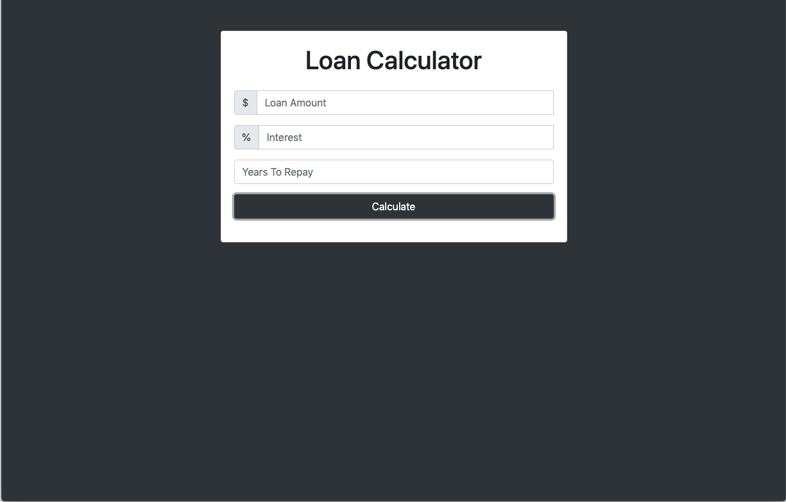
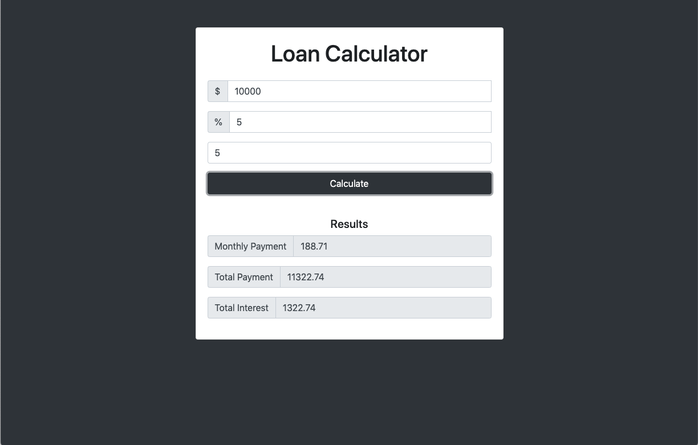

<h1 align="center">Loan Calculator</h1>

A loan calculator built with JavaScript

## Features
* Users can enter a loan amount, interest rate, and years to repay
* Loading animation displays upon submission
* Calculates and displays the results for monthly payment, total payment, and total interest
* An error message displays if the input is invalid

## Screenshots

## Technologies used
* HTML
* CSS
* JavaScript

## Inspirations
This project was built as part of Brad Traversy's Udemy course
